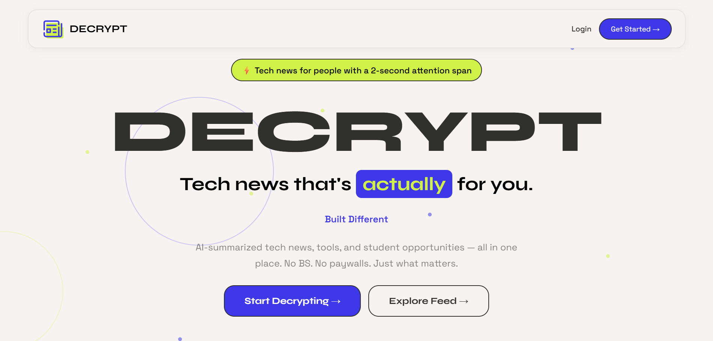
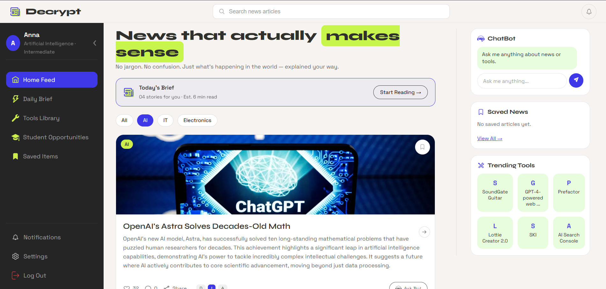
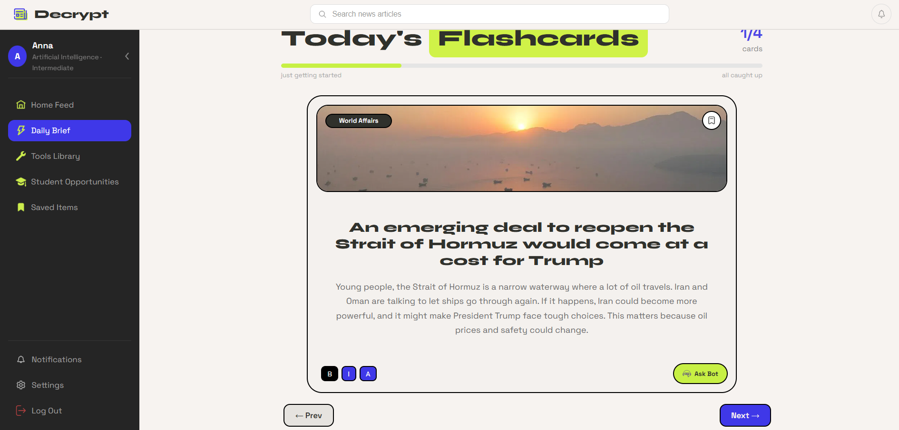
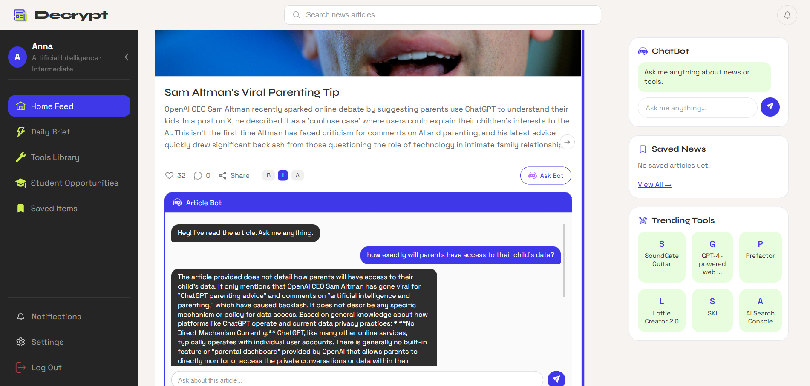
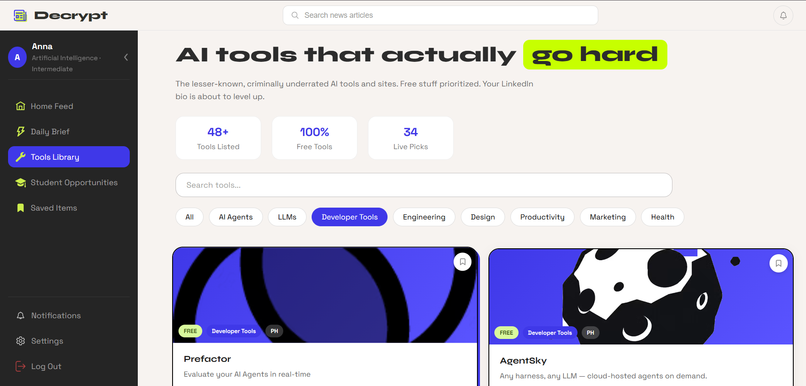
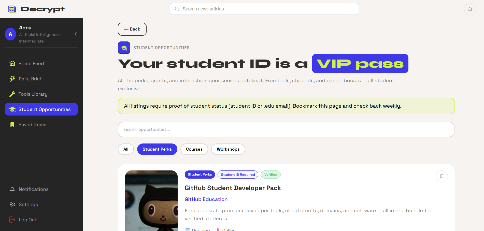
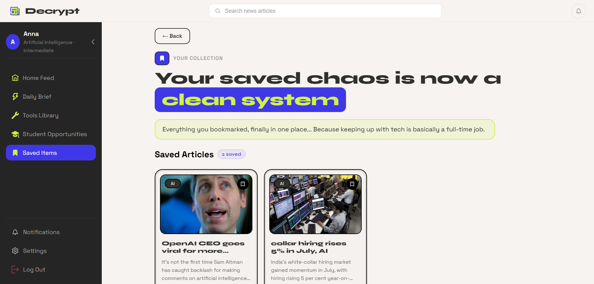
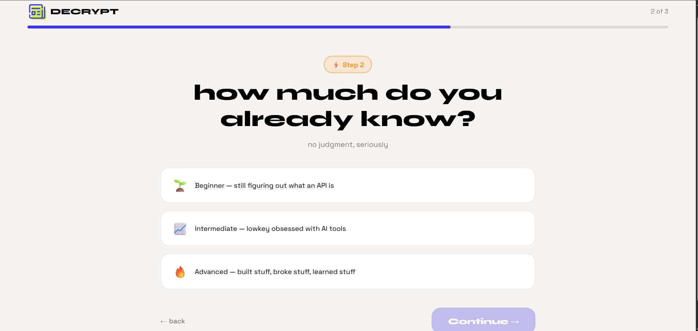

# 🚀 Decrypt

> **An AI-powered personalized platform that transforms complex news into engaging, bite-sized insights in 3 modes beginner, intermediate, advanced along with an article chatbot helping students understand tech news easily and discover the best underrated AI tools/websites and opportunities.**

---

## 🎥 Project Demo

Watch the complete walkthrough here:

**Demo Video:**  
https://www.youtube.com/watch?v=T4eGkr_Ed_c


---

# ✨ Overview

Decrypt is a full-stack AI-powered web platform built to solve one simple problem:

**Technology news is difficult to follow.**

Instead of overwhelming users with long articles and technical jargon, Decrypt delivers:

- 📰 Personalized News Feed
- ⚡ AI-generated Daily Flashcards
- 🤖 Interactive Article Chatbot
- 🛠 Curated AI Tools Library
- 🎓 Student Opportunities
- ⭐ Save Articles, Tools & Opportunities

Every feature is designed to make technology easier to understand for students and beginners while still remaining useful for experienced users.

---

# 🛠 Tech Stack

### Frontend

- React.js
- React Router
- CSS3
- Vite

### Backend

- Flask
- Python

### AI

- Google Gemini
- Groq

### Database

- Firebase Authentication
- Cloud Firestore

### APIs

- GNews API
- Product Hunt API

---

# ⭐ Features

---

## 📰 Personalized Home Feed

The Home Feed displays today's latest news across multiple domains including AI, Information Technology and Electronics.

Features:

- Personalized categories
- Search functionality
- Infinite scrolling
- Lazy loading
- Smart article caching
- Dynamic news fetching
- Save articles
- Article chatbot (contains context of that particular news article)
- Interactive chatbot

### Screenshot





---

## ⚡ Daily Brief

Daily Brief contains news from all domains across the world and converts them into easy-to-understand flashcards.

Features:

- AI-generated flashcards
- Progress tracking
- Previous / Next navigation
- Smart caching
- Lazy flashcard generation

### Screenshot



---

## 🤖 AI Article Chatbot

Every news article comes with an AI assistant capable of answering questions related to that article.

Users can:

- Ask follow-up questions
- Understand difficult concepts
- Get simplified explanations

### Screenshot



---

## 🛠 AI Tools Library

Discover Underrated AI tools and websites with detailed descriptions.

Features:

- Dynamic Product Hunt integration
- Category filtering
- Search
- Save favourite tools

### Screenshot



---

## 🎓 Student Opportunities

A dedicated section helping students discover:

- Hackathons
- Internships
- Courses
- Competitions
- Workshops

Updated dynamically from multiple sources.

### Screenshot



---

## ⭐ Saved Items

Users can bookmark:

- Articles
- AI Tools
- Flashcards
- Opportunities

Everything is stored separately for quick access.

### Screenshot



---


## 👤 Authentication & Personalization

Firebase Authentication provides secure login using:

- Email & Password
- Google Authentication
- GitHub Authentication

Users also complete a personalization flow to customize their experience.

### Screenshot



---

# ⚙️ Performance Optimizations

To reduce API usage and improve performance, Decrypt implements several optimizations:

- Intelligent article caching
- Lazy loading
- Incremental flashcard generation
- Daily cache refresh
- Duplicate article removal
- API call minimization

---

# 📁 Project Structure

```
frontend/
backend/
screenshots/
README.md
```

---

# 🚀 Future Improvements

- Responsive mobile experience
- Live deployment
- Multi-source news aggregation
- Redis-based caching
- Advanced recommendation engine
- User analytics dashboard

---

# 💡 Why I Built Decrypt

As someone who loves technology but often found traditional tech news overwhelming, I wanted to build a platform that explains complex topics in a simple, engaging way.

Decrypt combines AI, modern web development, and intelligent caching to create an experience where users can stay informed without information overload.

---

## 🌐 Live Demo

> 🚧 Deployment in progress

---


